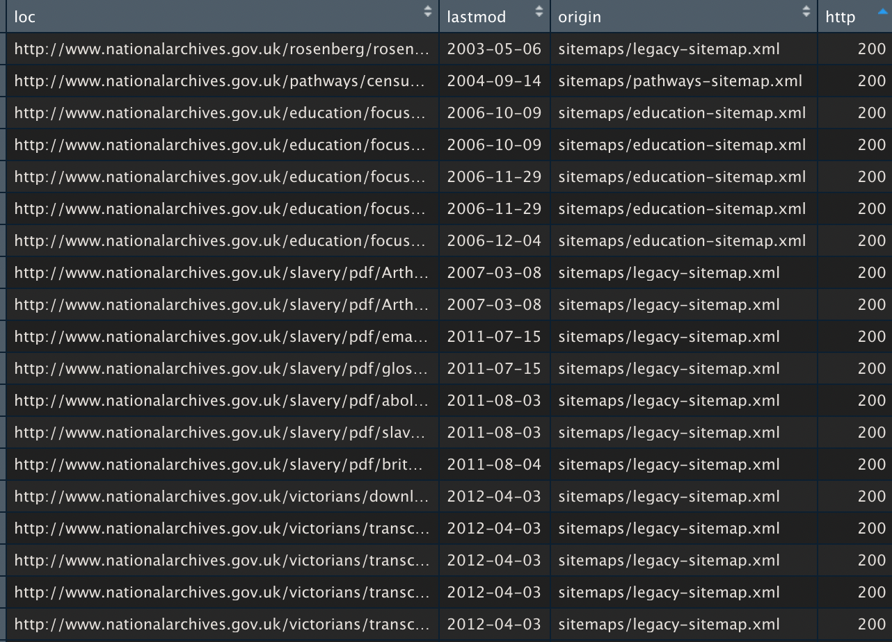
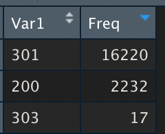

# Download and check XML sitemaps

It's not required to submit an XML sitemap to have a successful website but it's definitely an SEO nice to have. 

Nevertheless, if you do submit one, it's best to make sure it's error-free and as you will see its is quite straightforward to extract URLs using R

### Install xsitemap R’ Package \(to be done once\) and Load

```r
# Installing libraries
install.packages("devtools")
install_github("pixgarden/xsitemap")

# Loading libraries
library(devtools)
library(xsitemap)

```

### 

### Find and fetch XML sitemaps

```r
xsitemap_urls <- xsitemapGet("https://www.nationalarchives.gov.uk/")
```

This function will first search for XML sitemap url. It will first check the robots.txt file to see if an XML sitemap url is explicitly declared.

if not, the script will do some random guess \(‘sitemap.xml’, ‘sitemap\_index.xml’ , …\) most of the time, it will find the XML sitemap url.

Then, the XML sitemap URL is fetched and the URLs extracted.

If it’s a classic XML sitemap, a data frame \(special kind of array\) will be produced and return.

If it’s an **index** XML sitemap, the process will get back from the start with every XML sitemaps inside.

This will produce a data frame with all the information extracted. 

### \(optional\) Check URLs HTTP code

Another interesting function allows you to crawl the sitemap URLs and verify if your web pages send proper 200 HTTP codes \(HEAD Requests\)

It can take some time depending on the number of URLs. It took several hours for [https://www.gov.uk/](https://www.gov.uk/) for example.

```text
xsitemap_urls_http <- xsitemapCheckHTTP(xsitemap_urls)
```

It will add a dedicated column with the HTTP code filled in. You can check data inside rstudio by using 

```r
View(xsitemap_urls_http)
```



or if you prefer, [generate a CSV](../export-data/send-and-read-seo-data-to-excel.md#export-your-data-into-a-csv) 

### Count HTTP codes

Like in the [intro](../r-intro.md#the-power-of-r-whats-different-about-it), it's quite easy to count HTTP codes

```r
View(table(xsitemap_urls_http$http))
```

to discover, at the time of writing that most of the XML sitemap URLs are actually redirects...



### Plot the years the pages were added

You might have noticed that in this XML sitemap with a "lastmod" field. This an optional field which explicitly declares to google the date of the last modification of the url. This allows theoretically Google to optimise website crawls

It also allow us to understand how fresh is one's website content. We can plot it

```r

library(ggplot2)


ggplot(xsitemap_urls) +
 aes(x = lastmod) +
 geom_histogram(bins = 90L, fill = "#112446") +
 theme_minimal()
```

_\(I've got help from the_ [_esquisse_](../data-viz/using-esquisse-package-x.md) _library\)_


Let's try to get a clearer picture by extracting years

```r
# We extract from the Date the year and
# make another column called 'year'
xsitemap_urls$year <- format(xsitemap_urls$lastmod,"%Y")


# Removing not available values (NA's)
# and ploting the url by year
xsitemap_urls %>%
 filter(!is.na(year)) %>%
 
 ggplot() +
  aes(x = year) +
  geom_bar(fill = "#112446") +
  theme_minimal()
  
```


if if you prefere a % cumulative view:

```r
plot(ecdf(xsitemap_urls$year))
```


