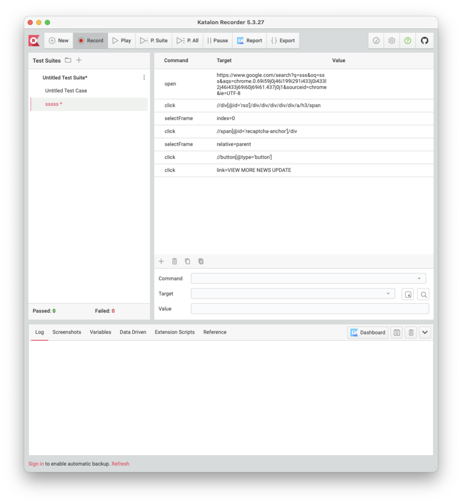

# Perform automatic browser tests with RSelenium

## What's **Selenium?**

Selenium is a classic tool for [QA](https://en.wikipedia.org/wiki/Quality_assurance) and it can help perform automatic checks on a website. This is an intro to how to use it

## **Why Selenium is an interesting solution?**

One of the great advantages of using Selenium is that **you can alternate automatic and manual actions** in the same session.  
  
For example, you can log on somewhere and run an automatic script after pretty easily or… fill in a captcha and run your script.

### Let's start

The first step is, as always, to install and load the RSelenium package

```r
#install to run once
install.packages("RSelenium")
library(RSelenium)
```

We’ll launch a selenium server with a Firefox browser in a controlled mode.  
  
It will take quite some time the first time but after it will load in a few seconds.

_here is the R command:_

```r
rd <- rsDriver(browser = "firefox", port = 4444L)
```


At the end of the process, it should open a firefox window like this one

Then we’ll grab the instance to be able to control our browser

```r
remDr <- rd[["client"]]
```

It’s now possible to send action to our browser.   
To open a website URL just type

```r
remDr$navigate("http://www.bbc.com")
```


You will notice the robot head icon which means that it is a remote-controlled browser  


Here are some useful commands:

```r
# find a dom element using the class selector and grab inner text
remDr$findElement(using = "class", value ="top-story")$getElementText()
 
 
# find a dom element using a class selector and click on it
remDr$findElement(using = "class", value ="top-story")$clickElement()
 
 
# get h1 textusing a tag selector
remDr$findElement(using ="tag", value = "h1")$getElementText()
 
 
# refresh browser
remDr$refresh() 
```

  
When you are done with it, don’t forget to 

```r
# close browser
remDr$close()
 
 
# stop the selenium server
rd[["server"]]$stop()
 
# and delete it
rm(rd)
```

Otherwise, it’s gonna be a mess when you’ll get back on it

## **How to quickly** configure a **Selenium scenario?**

You can check the [documentation](https://cran.r-project.org/web/packages/RSelenium/vignettes/basics.html) to learn all the function to find DOM elements and action but there is a quicker way:

Use a chrome extension like [Katalon recorder](https://chrome.google.com/webstore/detail/katalon-recorder-selenium/ljdobmomdgdljniojadhoplhkpialdid#:~:text=Katalon%20Recorder%20is%20the%20most,%2C%20automating%20games%2C%20etc.%20%E2%80%94), record and copy/paste the instructions directly




