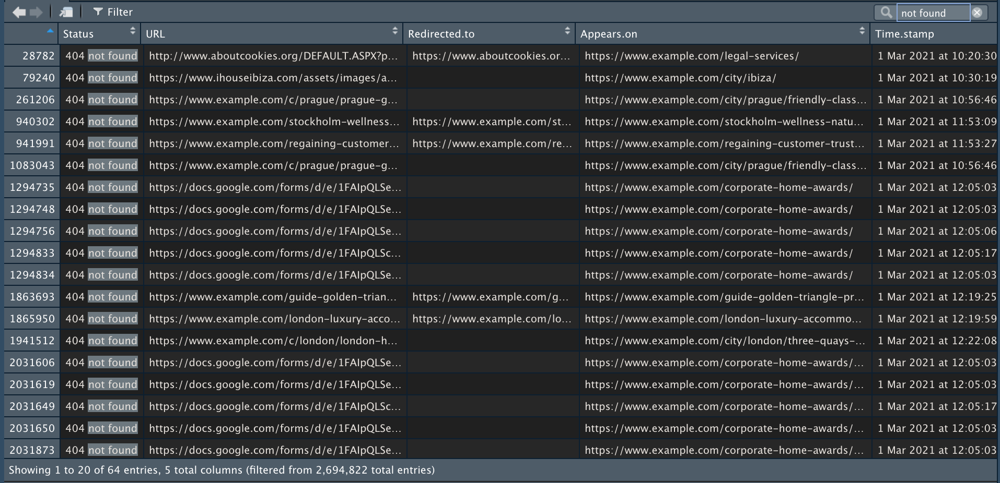
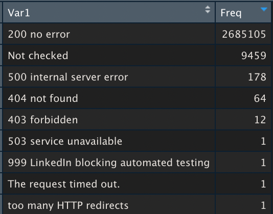

# it's an R World X

## The power of R. What's different about it?

if we were to talk about only one benefit, R is a language High-level programming language that mainly focuses on data. Meaning it's "specialized". With one or a few lines of code, you can do a lot. Let me give you an example:

```r
View(read.csv(file.choose()))
```

This line of code, executed inside [RStudio](classic-r-operations.md#install-and-rstudio), will 

* prompt a select file menu for you to select a CSV  \(_file.choose_\)
* It will import inside R \(_read.csv_\) 
* Display it \(_View_\)


This is how you browse a file with 2.6 Million rows. Noticed to small search icon on the top right? Yes, you can search within it quite easily too.



Want to count HTTP code?  
we will do this in two steps, first we load the CSV file and save it as a variable. Nearly the same as before.

```r
internal_linking = read.csv(file.choose())
```

Then we are going to display the count of Status column values

```r
View(table(internal_linking$Status))
```

you can recognize the _View_ function from before. the table function just count values.

It displays



This is 20 secondes job. the most time-consuming part was to find the file on the hard disk. 

Of course, this is just some silly example there is countless way to do this thing \(third party app, terminal, excel pivot\) but it gives nice intro of possibilities.

## _'There is a package for that'_

### lubridate

### urltools


\_\_


## The confusing things about R

### The name

"R" is not the most Google-friendly name. So here a few sources to help:

* [https://rseek.org/](https://rseek.org/) r search engine
* [https://www.r-bloggers.com/](https://www.r-bloggers.com/) r blogs aggregator
* [https://www.bigbookofr.com/](https://www.bigbookofr.com/) all the R free books
* [https://github.com/search?l=R&q=seo&type=code](https://github.com/search?l=R&q=seo&type=code) github r source code search

### &lt;- 

If you've seen some R' code before and you might have been surprised to see this &lt;-  being used . it's just a legacy thing, historically R differentiate  "assignation"  and "comparison", example:

If you want to set the value of X to 3.   

```r
x <- 3
```

if you want to make a comparison

```r
if (x = 3) {
    return "the value of X is 3"
}
```

If you want to keep this little _tradition_ alive you can do the same thing or use **=**

```r
x = 3
x <- 3
```

those are actually [nearly](https://stackoverflow.com/questions/1741820/what-are-the-differences-between-and-assignment-operators-in-r) equivalent.

#### %&gt;%

 **%&gt;%** operator, introduced by [magrittr](https://cran.r-project.org/web/packages/magrittr/vignettes/magrittr.html) package, is like the **&gt;** \( “pipe”\) for terminal command line. The operations are carried out successively. Meaning the results of the previous command are the entries for the next one.

Always better with an example:

```r
# those are equivalent
mean(abs(1))
#
1 %>% abs() %>% mean()
```

It seems a bit silly like that its   
more info on this [https://r4ds.had.co.nz/pipes.html](https://r4ds.had.co.nz/pipes.html)

