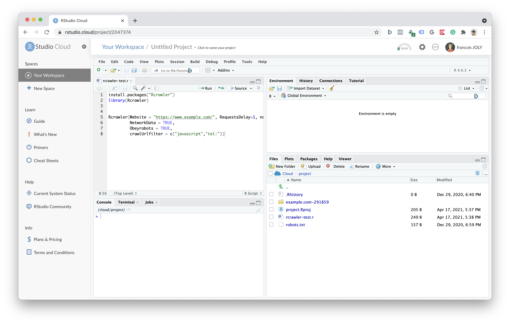

# Execute R code online

### Use RPubs

If the data is public and you want to show off your R skills you can use rpubs directly

You'll need to install the [knitr](https://github.com/yihui/knitr#readme) package \(v0.5 or later\), there is a mini-tutorial just after registration

[register](https://rpubs.com/)

### Use RStudio Cloud

There is a 'Cloud' version of RStudio, perfect for a quick demo. For more serious work, there is some [dedicated plans](https://rstudio.cloud/plans/free).



Create an account here [https://rstudio.cloud/](https://rstudio.cloud/)

### Use GoogleColab

This is a little-known option but it's possible to use R inside GoogleColab

Start [_rmagic_](https://rpy2.github.io/doc/latest/html/interactive.html) by executing this in a cell:

```text
%load_ext rpy2.ipython
```

Then start your script by `%%R` to execute

```r
%%R

x <- 1:10

x
# it should display number from 1 to 10
```

[more details about this feature](https://towardsdatascience.com/how-to-use-r-in-google-colab-b6e02d736497)

#### Native R on GoogleColab

[https://youtu.be/huAWa0bqxtA](https://youtu.be/huAWa0bqxtA)


